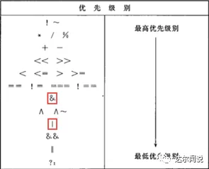

## 学习要点

基本逻辑

接口逻辑：uart can spi lvds

状态机，线性序列机（计数器，按时间分片）

IP的使用，第三方厂家，包括计数器，io接口，fft，各种软核CPU

接口设计

时序分析，时序约束

## wire与reg的区别

wire

- wire型数据通常用来表示用以assign关键字指定的组合逻辑信号
- verilog程序模块中输入输出信号类型默认时自动定义为wire型
- wire型信号可以用作任何方程式的输入，也可以用作assign语句或实例原件的输出

reg

- reg型数据常用来表示always模块内的指定信号，常代表触发器
- 在时序逻辑always模块内被赋值的每一个信号都必须被定义为reg型
- reg型数据的默认初始值是不定值

触发器和锁存器的区别

- 锁存器靠控制信号的电平实现数据的保存
- 触发器靠控制信号的边沿变化实现数据的保存

## cpld与fpga的异同

- fpga是在cpld之后发展出的一种更复杂的pld
- fpga集成了更多且更复杂的资源，包括可配置的逻辑块，时钟资源，时钟管理模块，块存储资源，互联资源，专用dsp模块，输入/输出块，XADC模块等，在一些高性能的fpga内还提供了吉比特收发器和PCI-E模块等硬核资源
- cpld使用与或阵列，fpga使用查找表结构，这是fpga最基本的原理

## 查找表LUT（look-up table）原理

- 由布尔逻辑代数理论可知，对于一个n输入的逻辑运算，最多产生2的n次方个不同的组合，如果预先将每个逻辑输入对应的结果保存在一个存储单元中，就相当于实现了逻辑门电路的功能
- fpga内的组合逻辑电路均由查找表实现
- LUT实现组合逻辑电路的功能由输入决定，而不是由复杂度决定
- LUT实现组合逻辑有固定的传输延迟 

- 相较于传统的逻辑门电路，LUT实现组合逻辑电路的功能克服了以下缺点
  - 逻辑门电路的输入变量从输入经过逻辑门运算后送到逻辑输出变量，存在一定的延时，延迟大小与逻辑电路的复杂度相关，并且是不确定的，延迟时间的不确定，工作频率就不确定，工作频率与时序逻辑电路的工作速度密切相关，由于工作速度的不确定，从而影响到了整个电路的性能
  - 逻辑电路的复杂度与输入逻辑变量的个数和逻辑电路所使用的逻辑门的数量有关，很明显，逻辑电路输入变量越多，电路越复杂

## verilog 操作符优先级




## 约束文件

- xlinix vivado集成开发环境使用xlinix 设计约束（xlinix design constraints，XDC）
- XDC是基于标准的synopsys设计约束（synopsys design constraints，SDC）的
- XDC文件特点
  - 不是简单的字符串，遵循tcl语法命令
  - 通过vivado tcl 翻译器就可以像理解tcl命令那样理解他们
  - 可以读取tcl指令，然后按照顺序对命令进行分析
- 如何添加XDC
  - 在设计的不同阶段均可添加XDC，将约束保存在一个或者多个XDC文件中
  - 通过read_xdc命令
  - 将他添加到其中一个设计工程的约束集中
- 通过TCL脚本生成的约束，可以通过下面的方法运行TCL脚本
  - 运行source命令
  - 将TCL叫脚本添加到其中一个设计工程约束集中

## 模块端口定义

- 三种模块端口定义，input， output， inout

- 我是这么理解的，首先在模块命后的括号内定义端口，然后声明端口
  - 声明端口时同时声明端口的数据类型，没有声明端口类型的情况下默认为线网类型，端口类型有线网（net）型和寄存器（reg）型
  - 有符号（signed）型数据，无符号型数据，没有声明端口有无符号时，默认为无符号型的端口

## verilog的描述方式

- 行为级描述是verilog hdl最高抽象级别的描述方式，可以按照要求来实现一个设计算法，而不用关心具体的实现方式，但是行为级描述是不可以被综合的，行为级描述语句可以描述逻辑行为，包括initial语句和always语句，用于对设计进行仿真，不能转化为实际的电路结构。

- 寄存器传输级（rtl）级描述，数据流描述，可以理解为在一个复杂的数字系统中，应该包含有数据流和控制流，控制流用于控制数据的流向，寄存器传输，任何数据从输入到输出，都需要经过寄存器来对数据重定序，这样，保证数据从输入到输出满足书序收敛的条件，不会出现竞争冒险与亚稳定状态。完成后将转化为实际的电路

## 系统任务和函数，编译器指令

- 以" $ "开始的标识符表示系统任务或者系统函数
- 以" ` "开始的的某些表示符看做编译器指令

## verilog 中数字的使用

- 不太理解：" 在任何时候，负数应该使用二进制补码形式表示 "，这是啥意思？

- ```<+/-><size><'base_format><number>```
- 第一的尖括号里为正负，可正可负也可以不写，不写默认为正数或者无符号数
- 第二个尖括号为位宽，在使用数字时必须带位宽，位宽包括有符号数的符号位
  - 未指定位宽，默认位宽至少32位
  - size位宽小于number位宽，将高位截断，保留低位
  - size位宽大于number位宽，根据正负（符号位）补全，正数补0，负数补1；无符号数补0；number最高位为x/z则同样补x/z
- 第三个尖括号为数的格式，base_format = {b, o, d, h, sb, so, sd, sh}，s代表为有符号数，
  - 可有与第一个尖括号中的正负搭配使用，完全的定义，不会产生歧义
  - 也可以只有第一个尖括号中的正负不写s，有点问题哎，尽量避免这样的定义
  - 也可以没有第一个尖括号的正负值有后面的s，当然是默认为正的有符号数
- 第四个尖括号中可以出现的数字为 number = {0, 1, 2, 3, 4, 5, 6, 7, 8, 9, a, b, c, d, e, f, x, z, ?}(不区分大小写)以及作为连接符的下划线"_",
  - x不确定态，z高阻态，？作用同z
  - x,z,?，根据base_format的定义，所代表的位宽可以为1,2,4，当然十进制的话我也不知啦，不要那么用，没有意义

## 属性attribute

- 参见数字设计权威指南何宾

- 知道但不会用，感觉是指定一些特定的东西，在综合是加进去，比如之前用过的探针属性，属性有自己的名字，以及自己对应的值

## testbench文件中的时间定义

Verilog语言中预先定义了一些任务和函数，用于完成一些特殊的功能，它们被称为系统任务和系统函数，这些函数大多数都是只能在Testbench仿真中使用的，使我们更方便的进行验证。

`timescale1ns**/**1ns //时间尺度预编译指令时间单位/时间精度

时间单位和时间精度由值1、10、和100以及单位s、ms、us、ns、ps和fs组成

时间单位：定义仿真过程所有与时间相关量的单位，仿真中使用 “#数字”表示延时相应时间单位的时间，例#10表示延时10个单位的时间，即10ns

时间精度：决定时间相关量的精度及仿真显示的最小刻度

`timescale1ns**/**10ps 精度0.01，**#**10.11表示延时10110ps

而下面这种写法就是错误的，因为时间单位不能比时间精度小

`timescale100ps**/**1ns

```1 s = 1,000 ms = 1,000,000 μs = 1,000,000,000 ns = 1,000,000,000,000 ps```

皮秒，符号ps（英语：picosecond ），1皮秒等于一万亿分之一秒（```10^(-12)s```）

``` 1,000 ps= 1ns```

```1,000,000 ps = 1μs ```

```1,000,000,000 ps = 1ms```

```1,000,000,000,000 ps = 1s```

纳秒，符号ns（英语：nanosecond ），1纳秒等于十亿分之一秒（```10^(-9)s```）

```1 ns= 1000ps```

```1,000 ns= 1μs ```

```1,000,000ns = 1ms```

```1,000,000,000 ns= 1s```

微秒，符号μs（英语：microsecond ），1微秒等于一百万分之一秒（```10^(-6)s```）

```0.000 001 μs= 1ps```

```0.001 μs= 1ns```

```1,000 μs= 1ms```

```1,000,000 μs= 1s```
毫秒，符号ms（英语：millisecond ），1毫秒等于一千分之一秒（10-3秒）

```0.000 000 001 ms= 1ps``` 

```0.000 001 ms= 1ns ```

```0.001 ms = 1μs ```

```1000 ms = 1s```

```verilog
`timescale 1ns/1ps //单位/精度
#100 //延时100ns
//-------------------------
`timescale 10ns/1ps
#100//延时100*10ns
#0.1//0.1ns = 1ps，仿真精确到小数点后一位
```

## 时钟管理单元（PLL，DLL）

​	PLL（Phase-Locked Loop）相位锁定的环路，也就是常说的锁相环，锁相环在模拟电路和数字电路系统中均有广泛的应用，很多mcu芯片如stm32，msp430，等都集成了片上的pll，用来通过片外较低频率的晶振产生的时钟倍频得到较高频率的时钟信号以供mcu内核和片上的外设使用，在很多的洗衣芯片中也用到得了pll来通过较低的晶振时钟得到符合协议要求的时钟信号，例如典型的usb协议芯片

- 锁相环 PLL
  - PLL （phase locked loop，锁相环），模拟电路
  - pll与dll的区别：pll是数字的，dll是模拟的，pll精度较高
  - 特性：能够将输入的周期信号就行分频和倍频，并最终输出一个或多个稳定的，与输入信号频率和相位相关的信号
  - 总结：能够通过对输入的时钟信号进行分频，倍频，相位控制，从而得到一路或者多路更高或者更低的时钟信号

## 参数传递

- define 与localparam和parameter最大的区别就是 define 可以跨文件传递参数；parameter只能在模块间传递参数；而localparam只能在其所在的module中起作用，不能参与参数传递。

  1. 新建参数模块文件（我命名为para.v）；

  2. 在para.v文件中使用'define宏定义参数（部分）

     ```verilog 
     //`define+name+参数 　
     `define 　　STATE_INIT	3'd0
     `define 　　STATE_IDLE	3'd1
     `define 　　STATE_WRIT	3'd2
     `define 　　STATE_READ	3'd3
     `define 　　STATE_WORK	3'd4
     `define 　　STATE_RETU	3'd5
     ```

  3. 在需要调用参数的文件init.v中使用`include "para.v"：

     ````include "para.v"```

4. 在init.v文件需要参数的地方使用`name 调用（部分）：`

   ````state_init <= `STATE_INIT;```

  5. localparam与parameter的区别与用法

- parameter可用作在顶层模块中例化底层模块时传递参数的接口；

- localparam的作用域仅仅限于当前module，不能作为参数传递的接口。

- ```Verilog
  //用法
  parameter       DATA_WIDTH = 16;
  parameter       ADDR_WIDTH =  5;
  localparam      DW = DATA_WIDTH - 1;
  localparam      AW = ADDR_WIDTH - 1;
  
  ```

## 电源设计

- cyclone IV E 需要三组供电
  - 内核供电   1.0V；非低电压版本为1.2V
  - pll模拟电路供电，数字电路供电1.2V，模拟电路供电固定的2.5V，使用LDO器件 
  - I/O单元供电，电压值从1.2V~3.3V（1.2；1.5；1.8；2.5；3.0；3.3），共6中可选值，IO Bank 每个bank的IO供电都可以不同

## 配置电路设计

- cyclone IV E 基于SRAM的结构的，SRAM掉电就会丢失，因此系统上电后，必须要有配置电路将正确的配置数据加载到SRAM中，然后FPGA才能正常运行
- 五种配置方式（AS，AP，PS，FPP，JTAG）
  - AS 主动串行方式，电路简单，成本低廉，常用语中小容量的FPGA
  - AP主动并行方式，消耗引脚比较多，常用于配置过程的时间要求较高
  - PS被动串行方式，使用一个外部的主机MCU或者CPLD，常用于通过网络方式对fpga的升级
  - JTAG配置方式，可以在器件正常工作过程中捕获运行数据，JTAG指令具有最高优先级
- 对FPGA进行配置
  - FPGA中没有flash，FPGA基于sram架构，掉电程序丢失，FPGA程序存储在外部的flash中，叫做epcs， 实际上是就是spf flash芯片（stm32 片上程序一般存储在flash中）
  - 使用jtag直接配置 .sof，FPGA 掉电，就会变成白片
  - 使用外部器件进行片配置，flash不会丢失，FPGA上电时主动加载程序
  - 使用外部的控制器进行配置

## 硬件乘法单元

- 18*18硬件乘法器，乘数和被乘数输入宽度最大为18位的乘法器
- 乘法器电路复杂，使用fpga内部资源能实现，但是性能会受限，也消耗更多的面积，不利于降低成本和功耗
- 硬件乘法单元在芯片设计时功能和布局都已经确定，即使不使用，他也在
- 每个硬件乘法电路也能拆分成两个位宽为9的存储器 

## 编码方式的区别

对于状态机

- 独热码，每一个状态均使用一个寄存器， 在于状态比较时仅仅需要比较一位， 相比其他译码电路简单；

- 格雷码，所需寄存器数与二进制码一样，译码复杂，但相邻位只跳动一位，一般用于异步多时钟域多 bit 位的转换，如异步 FIFO；

- 二进制码，最为常见的编码方式，所用寄存器少，译码较复杂。 

对于计算

- BCD 码中最常用的是 8421 码，其各个 bit 权值分别是 8d、 4d、 2d、 1d

- 同理 5421 码各位的权依次为 5d、 4d、 2d、 1d。 5421 码特点是最高位连续 5 个 0 后连续 5 个 1，故其当计数器采用这种编码时，最高位可产生对称方波输出

- 余 3 码是在 8421 码上加 0011b 的出来的；

- 格雷码的特点是任意两个相邻的代码只有一位二进制数不同，编码格式不唯一；

- 余 3 循环码具有格雷码的特点并且编码的首尾可以连接来进行循环，这样可用反馈移位寄存器来实现，硬件实现简单。 

- BCD码利于十进制的计算

  BCD 码的运算规则： BCD 码是十进制数，而运算器对数据做加减运算时，都是按二进制运算规则进行处理的。这样，当将 BCD 码传送给运算器进行运算时，其结果需要修正。修正的规则是：当两个 BCD 码相加，如果和等于或小于 1001b(即十进制数 9)，不需要修正；如果相加之和在 1010b 到 1111b(即十六进制数 0AH～0FH)之间，则需加 6d 也就是 0110 进行修正；如果相加时，本位产生了进位，也需加 6 进行修正。下面举例说明：计算 5+8，将 5和 8 转换为 8421 BCD 码后输入加法器，则运算如下： 0101 + 1000 = 1101 结果大于 9d，+0110b 即加 6d 修正得出 10011b，补充高位为 0001_0011b。 即 5+8=13，结论正确。

  BCD 码的主要应用之一就是数码管，假设要将十进制数 158 显示， 一般解决办法是把需要显示的十进制数的个、十、百、千位数等进行拆分，即把 158 拆分出 1、 5、 8，然后查出对应的数码管显示段码再送去给数码管连接的 IO 口。这个过程可以进行下面的运算：先进行除法运算 158/100 得出百位 1，再取余 158%100 = 58 后继续进行除法运算 58 / 10 得出十位 5，再进行一次取余 158%10 ，得到个位 8。以上过程可以看出需要除法，但是由于除法运算是比较消耗计算时间导致整体需要的指令周期太久。但是如果先将其转换为 BCD 码，则可大幅度减少运算时间。 具体应用将在数码管一讲中详细介绍。 

## readmemb与readmemh的使用

1. 在verilog中有$readmemh(“filename”, mem_name)命令，在使用这个命令时，”filename”中的路径要用反斜杠’/’，而不是斜杠’\’。如

   - $readmemh("F:/mydesigen/re_input.txt",re_input);

   - 上面的语句是正确的，而如果用斜杠就有问题，如

   - $readmemh("F:\mydesigen\re_input.txt",re_input);

2. readmemb（“D：/file1/file2/ramh.dat”，a）；即可以调用到放置在任意处的存储文件。当采用$readmemb（“ramh.dat”，a）；这种方式时，ramh.dat文件必须放置在工程下的simulation文件夹下，亲测其他放置都无效。

3. 关于存储文件后缀，.dat .txt 甚至不加后缀都可以，只要保证程序里调用的与文件夹中实际的一致，可以索引到即可

4. 对于需要的txt文件，其格式为每行一个数据，存储顺序。文档中由上至下，对应数组由低到高。

   - 例如用matlab产生文件则可以这样写

     ```fid0 = fopen('F:\path\re_input.txt','w+');```

     ```fprintf(fid0,'%x \n',real(info));```

     其中的换行符是必须的。同时，在matlab中，路径语句的斜杠’\’或是反斜杠’/’都没有问题。

5. 不可综合。readmemb、readmemh、initial 都是不可综合语句（怎么可以这样呢！那大数组怎么赋值？）也就是说只能在仿真时调试用。

6. 对于$readmemh对应的16进制文件，不用写成4'hA，最简单的A即可。

## verilog 中计算的化简

- 可以将其拆分为2的幂级数，比如10 = 2+8，尽量不要使用乘法器
- 如果相除之后产生大量小数位，可以先将被除数扩大到商没有小数，将计算结果进行其他计算，最终在将结果缩小相应的倍数，因为在FPGA终没有浮点数这一说，所有产生小数的结果，只能精确到1，采用上述方法后，可以将结果进一步的精确
- 如果结果太大可以将结果扩大的倍数放小一点，这样造成的为是结果精度的减小
- 考虑溢出问题

## 阻塞赋值与非阻塞赋值的六个原则

- 时序电路建模时，用非阻塞赋值；
- 锁存器电路建模时，用非阻塞赋值；
- 用 always 块建立组合逻辑模型时，用阻塞赋值；
- 在同一个 always 块中建立时序和组合逻辑电路时，用非阻塞赋值；
- 在同一个 always 块中不要既用非阻塞赋值又用阻塞赋值；
- 不要在一个以上的 always 块中为同一个变量赋值。  

## 原语，primitive

不同的厂商，原语不同；同一家的FPGA，不同型号的芯片，可以也不一样；原语类似最底层的描述方法。使用原语的好处，可以直接例化使用，不用定制IP；即可通过复制原语的语句，然后例化IP，就可使用；Xilinx是通过直接修改原语中的参数再例化IP来使用；Xilinx公司的原语分为10类，包括：计算组件，IO端口组件，寄存器/锁存器，时钟组件，处理器组件，移位寄存器，配置和检测组件，RAM/ROM组件，Slice/CLB组件，G-tranceiver。

硬件原语比较底层，可以针对一个逻辑单元来操作，是软件中集成好的，不需要向调用IP核那样复杂的过程，可以直接在代码中调用，当然功能相对比较简单。而IP核功能比较多，调用时需要设置很多参数。

## 扇入/扇出

扇入（fan-in）是定义单个逻辑门能够接受的数字信号输入最大量的术语。大多数TTL逻辑门有一个或两个输入端，也有一些有两个以上的输入端。一个典型的逻辑门有1、2个扇入信号。

在 软件工程中，模块的扇入是指有多少个上级模块调用它。扇入越大，表示该模块被更多的上级模块共享。这当然是我们所希望的。但是不能为了获得高扇入而不惜代价，例如把彼此无关的功能凑在一起构成一个模块，虽然扇入数高了，但这样的模块内聚程度必然低。这是我们应避免的。

扇出（fan-out）是一个定义单个逻辑门能够驱动的数字信号输入最大量的专业术语。大多数的TTL逻辑门能够为10个其他数字门或驱动器提供信号。因而，一个典型的TTL逻辑门有10个扇出信号。
　　在一些数字系统中，必须有一个单一的TTL逻辑门来驱动10个以上的其他门或驱动器。这种情况下，被称为缓冲器的驱动器可以用在TTL逻辑门与它必须驱动的多重驱动器之间。这种类型的缓冲器有25至30个扇出信号。逻辑反向器（也被称为非门）在大多数数字电路中能够辅助这一功能。


一个模块的扇出数过大或过小都不理想，过大比过小更严重。一般认为扇出的上限不超过7。扇出过大意味着管理模块过于复杂，需要控制和协调过多的下级。解决的办法是适当增加中间层次。

一个模块的扇入是指有多少个上级模块调用它。扇人越大，表示该模块被更多的上级模块共享。这当然是我们所希望的。但是不能为了获得高扇人而不惜代价，例如把彼此无关的功能凑在一起构成一个模块，虽然扇人数高了，但这样的模块内聚程度必然低。这是我们应避免的。

设计得好的系统，上层模块有较高的扇出，下层模块有较高的扇人。其结构图像清真寺的塔，上面尖，中间宽，下面小。

## PVT对电路性能的影响

制造工艺（Process）、工作电压（Voltage）、温度（Temperature）对芯片运行的速度影响很大，这三个量也就是我们常说到的PVT，数字电路设计时会做静态时序分析（STA），分析在各种PVT条件下芯片的时序是否满足要求，也就是对芯片的工作速度进行分析。在分析建立时间是否满足时序要求时要使用慢速模型，即高温+低压+慢速模型；分析保持时间是否满足时序要求时要使用快速模型，即低温+高压+快速模型。而封装方式不是对电路工作速度的主要影响因素。

## 串行总线/并行总线。

**串行数据传输时**，数据是一位一位地在通信线上传输的，先由具有几位总线的计算机内的发送设备将几位并行数据经并-串转换硬件转换成串行方式，再逐位经传输线到达接收站的设备中，并在接收端将数据从串行方式重新转换成并行方式，以供接收方使用。

**并行通信传输中**有多个数据位，同时在两个设备之间传输。发送设备将这些数据位通过对应的数据线传送给接收设备，还可附加一位数据校验位。接收设备可同时接收到这些数据，不需要做任何变换就可直接使用。并行方式主要用于近距离通信，计算机内的总线结构就是并行通信的例子。

**SDIO** （Secure Digital Input and Output）是SD型的扩展接口，SDIO协议是由SD卡的协议演化升级而来的，很多地方保留了SD卡的读写协议，同时SDIO协议又在SD卡协议之上添加了CMD52和CMD53命令。所以SDIO和SD卡规范间的一个重要区别是增加了低速标准，低速卡的目标应用是以最小的硬件开始来支持低速I/O能力。其特点是：（1）与多媒体卡系统规格书版本4.2全兼容，支持三种不同的数据总线模式：1位（默认）、4位和8位。（2）与较早的多媒体卡系统规格版本全兼容（向前兼容）。（3）与SD存储卡规格版本2.0全兼容。（4）与SD I/O卡规格版本2.0全兼容，支持两种不同的数据总线模式：1位（默认）和4位。（5）完全支持CE-ATA功能（与CE-ATA数字协议版本1.1全兼容）。8位总线模式下数据传输速率可达48MHz。（6）数据和命令输出使能信号，用于控制外部双向驱动器。所以不能简单的将SDIO划分到并行总线或串行总线，要看它用的是哪种模式，所以这里暂时不选。

**SPI**（SerialPeripheral Interface）是摩托罗拉公司提出的同步串行总线方式。3~4线接口，收发独立、可同步进行。因其硬件功能强大而被广泛应用。在单片机组成的智能仪器和测控系统中，如果对速度要求不高，采用SPI总线模式是个不错的选择。它可以节省I/O端口，提高外设的数目和系统的性能。标准SPI总线由四根线组成：串行时钟线（SCK）、主机输入/从机输出线（MISO）。主机输出/从机输入线（MOSI）和片选信号（CS）。有的SPI接口芯片带有中断信号线或没有MOSI。

**IIS**（Inter-IC Sound Bus）是飞利浦公司为数字音频设备之间的音频数据传输而制定的一种总线标准。I2S大部分是3线的（除了时钟和数据外，还有一个左右声道的选择信号），I2S主要用来传输音频信号。如STB、DVD、MP3等常用。I2S标准中，既规定了硬件接口规范，也规定了数字音频数据的格式。I2S有3个主要信号：（1）串行时钟SCLK，也叫位时钟（BCLK），即对应数字音频的每一位数据，SCLK都有1个脉冲。SCLK的频率=2×采样频率×采样位数。（2）帧时钟LRCK（也称WS），用于切换左右声道的数据。LRCK为“1”表示正在传输的是左声道的数据，为“0”则表示正在传输的是右声道的数据。LRCK的频率等于采样频率。（3）串行数据SDATA，就是用二进制补码表示的音频数据。所

**AHB**（AdvancedHigh Performance Bus）是AMBA（AdvancedMicrocontroller Bus Architecture）V2.0总线规范的一部分，AMBA总线规范是ARM公司提出的总线规范，被大多数SoC设计采用，它规定了AHB （Advanced High-performance Bus)、ASB (Advanced System Bus）、APB（Advanced Peripheral Bus）。AHB用于高性能、高时钟频率的系统结构，典型的应用如ARM核与系统内部的高速RAM、NAND FLASH、DMA、Bridge的连接。APB用于连接外部设备，对性能要求不高，而考虑低功耗问题。ASB是AHB的一种替代方案。AHB总线由AHB总线主机(Master)、AHB总线从机(Slave)和Infrastructure构成。Infrastructure由仲裁器、数据多路选择器、地址控制多路选择器、译码器构成。AHB总线有以下特性：（1）Burst 传输 。（2）Split 事务处理。（3）单周期Master移交。（4）单一时钟沿操作。（5）无三态。（6）更宽的数据总线配置（64bit/128bit）。


## 芯片测试

芯片测试实际上是一个比较大的范畴，一般是从测试的对象上分为晶圆测试和最终测试，对象分别是尚未进行封装的芯片和已经封装好的芯片。为啥要分两段? 简单的说，因为封装也是有成本的，为了尽可能的节约成本，可能会在芯片封装前，先进行一部分的测试，以排除掉一些坏掉的芯片。而为了保证出厂的芯片都是没问题的。最终测试是芯片测试的最后一道拦截，也是必须的环节。

晶圆测试（Wafer Test或CP-Chip Probering），Wafer就是晶圆，这个由Fab进行生产，上面规则地放着芯片（Die）。当晶圆上形成了一个个格状的晶粒时，通过针测的方式对每个晶粒进行电气特性检测。一般每个芯片的拥有的晶粒数量是庞大的，组织一次针测试模式是非常复杂的过程，这要求了在生产的时候尽量是同等芯片规格构造的型号的大批量的生产。数量越大相对成本就会越低，这也是为什么主流芯片器件造价低的一个因素。

最终测试（Final Test）也叫封装测试，所谓封装测试其实就是在芯片封装后进行的测试，把已制造完成的半导体元件进行结构及电气功能的确认，以保证半导体元件符合系统的需求的过程。

## 芯片参数

MTBF（Mean Time Between Failure）平均故障发生间隔时间，是衡量一个产品的可靠性指标，它反映了产品的时间质量，是体现产品在规定时间内保持功能的一种能力。具体来说，是指相邻两次故障之间的平均工作时间，也称为平均故障间隔，这个平均故障时间越久说明产品故障少的就是可靠性高

ATE（Auto Test Equipment）pattern count为测试机台的测试pattern数量，pattern多意味着测试全面

Fault coverage为故障覆盖率定义为在所有故障中检测到的故障的百分比，这个指标越高越好，100%是最好的效果

Yield在IC中表示芯片的良率，即达到标称性能规格的器件或电路的百分比，这个指标是越高越好

## 逻辑分析仪

- Intel的FPGA开发工具Quartus中的在线逻辑分析仪叫SignalTap
- Xilinx的FPGA开发工具Vivado中的在线逻辑分析仪叫ILA
- Xilinx的FPGA开发工具ISE中的在线逻辑分析仪叫ChipScopes
- Lattice的FPGA开发工具Diamond中的在线逻辑分析仪叫Reveal

逻辑分析仪是分析数字系统逻辑关系的仪器。逻辑分析仪是属于数据域测试仪器中的一种总线分析仪，即以总线（多线）概念为基础，同时对多条数据线上的数据流进行观察和测试的仪器，这种仪器对复杂的数字系统的测试和分析十分有效。逻辑分析仪是利用时钟从测试设备上采集和显示数字信号的仪器，最主要作用在于时序判定。由于逻辑分析仪不像示波器那样有许多电压等级，通常只显示两个电压（逻辑1和0），因此设定了参考电压后，逻辑分析仪将被测信号通过比较器进行判定，高于参考电压者为High，低于参考电压者为Low，在High与Low之间形成数字波形。

在对数字信号进行观察时，尤其是对FPGA中的内部、接口信号进行观察时，我们常常会用到逻辑分析仪，因为我们的数字信号只有高（1）和低（0），且很多信号是并行执行的，用逻辑分析仪来观察再适合不过了，且还可以通过FPGA开发工具在FPGA内部搭建在线逻辑分析仪（Intel的FPGA开发工具Quartus中的在线逻辑分析仪叫SignalTap、Xilinx的FPGA开发工具ISE中的在线逻辑分析仪叫ChipScopes、Xilinx的FPGA开发工具Vivado中的在线逻辑分析仪叫ILA、Lattice的FPGA开发工具Diamond中的在线逻辑分析仪叫Reveal），来抓取FPGA内部的信号，十分的方便。

信号间串扰适合用逻辑分析仪么？

- 我们先来了解下什么是串扰。串扰是两条信号线之间的耦合、信号线之间的互感和互容引起线上的噪声。容性耦合引发耦合电流，而感性耦合引发耦合电压。PCB板层的参数、信号线间距、驱动端和接收端的电气特性及线端接方式对串扰都有一定的影响。检查这种问题用示波器是最好的了。

信号上升缓慢可以用逻辑分析仪观察么？信号的占空比可以用逻辑分析仪么？

- 信号上升沿缓慢是一个过程变化，不是所谓的只有高（1）和低（0）的情况，应该用示波器来观察，而不是逻辑分析仪
- 逻辑分析仪是可以观察到波形占空比不同的，但是想要观察占空比的细微差别是很难做到的，可以看出不同的比例，但是并不能看出时钟的抖动，时钟的抖动导致占空比这种细微误差的现象，这就很难用逻辑分析仪来观察了，必须通过示波器测量来发现问题。

组合的数字逻辑出现异常可以用逻辑分析仪观察么？

- 如果说组合的数字逻辑的各个信号是并行的且还是数字信号，那无疑是用逻辑分析仪来找问题，平时我们仿真也是这么做的，但如果是多个模拟信号之间的组合的话那用逻辑分析仪就很难分析了，虽然这种情况很少见，更多的是数字信号之间的组合所以综合对比

## 关于Xilinx器件和Vivado适用的代码风格

- 多使用Vivado自带的代码模板；
- 尽量避免使用异步复位；
- 在模块边界上使用寄存器而非组合逻辑；
- 使用流水结构来降低逻辑层数；
- 采用适当的RAM和DSP的实现方式（是否选用硬核）；
- 在综合后或是逻辑优化（opt_design）后的时序报告上分析代码优化的方向。