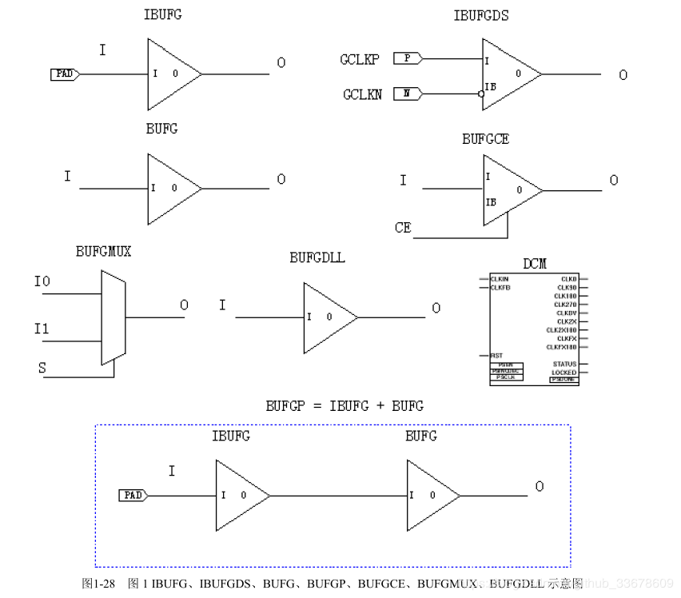
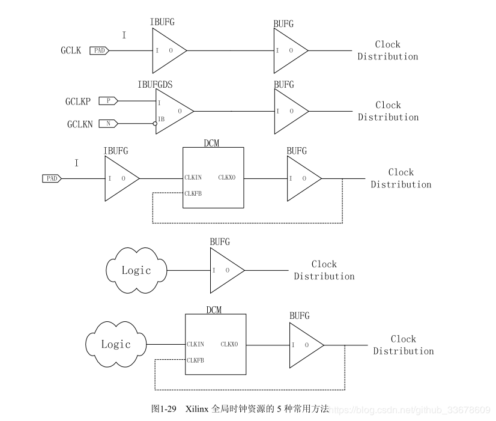

1. IBUFG 即输入全局缓冲，是与全局时钟输入管脚相连接的首级全局缓冲。所有从全局时钟管脚输入的信号必须经过IBUFG单元，否则在布局布线时会报错。IBUFG支持AGP，CTT，GTL，GTLP，HSTL，LVCOMS，LVDCI，LVPECL，LVTTL，PCI，PCIX，SSTL等多种格式的IO标准
2. IBUFGDS 是IBUFG的差分形式，当信号从一堆差分时钟管脚输入时，必须使用IBUFGDS支持BLVDS，LDT，LVDSEXT，LVDS，LVPECL，ULVDS等多种格式的IO标准
3. BUFG即全局缓冲，它的输入是IBUFG的输出，BUFG的输出到达FPGA内部的IOB，CLB，Block Select RAM的时钟延迟和抖动最小
4. BUFGCE是带有时钟的全局缓冲，它的一个输入I，一个使能端CE，一个输出端O。仅当BUFGCE的使能端CE有效（高电平）时，BUFGCE才能输出
5. BUFGMUX 是全局时钟选择缓冲，他有两个输入I0和I1，一个控制端S一个输出端O，当S为低电平时输出时钟为I0，反之为I1，需要指出的是BUFGMUX的应用十分灵活，I0和I1两个输入时钟甚至可以为异步关系
6. BUFGP相当于IBUFG加上BUFG
7. BUFGDLL是全局缓冲延迟锁相环，相当于BUFG和DLL的结合，在早期设计中经常使用，用以完成全局时钟的同步，驱动等功能，随着数字时钟管理单元DCM的日益完善，目前BUFGDLL的应用已经逐渐被DCM所取代
8. DCM即数字时钟管理单元，主要完成时钟的同步，相移，分频，倍频，去抖等，DCM与全局时钟有着密不可分的练习，为了达到做小的延迟和抖动，几乎所有的DCM应用都要使用全局缓冲资源

1. IBUFG + BUFG的使用方法：
   - IBUFG后面连接BUFG的方法是最基本的全局时钟资源的使用方法，由于IBUFG组合BUFG相当于BUFGP，所以在这种使用方法也称为BUFGP方法。

2. IBUFGDS + BUFG的使用方法：
   - 当输入时钟信号为差分信号时候，需要使用IBUFGDS代替IBUFG。

3. IBUFG + DCM + BUFG的使用方法：
   - 这种使用方法最为灵活，对于全局时钟的控制更加有效。通过DCM模块不仅仅能对时钟进行同步、移相、分频、倍频等变换，而且可以使全局时钟的输出达到无抖动延时（‘0’ skew）。

4. Logic + BUFG的使用方法：
   - BUFG不但可以驱动IBUFG的输出，还可以驱动其他普通信号的输出。当某个信号（时钟、使能、快速路径）的扇出非常大，并且要求抖动延迟最小时，可以使用BUFG驱动该信号，使该信号利用全局时钟资源。但是需要注意的是，普通IO的输入或普通片内信号进入全局时钟布线层需要一个固定的延时，一般在10ns左右，也就是说普通IO和普通片内信号从输入到BUFG输出有一个约10ns左右的固定延时，但是BUFG的输出到片内所有单元（IOB、CLB、Block Select RAM）的延时可以忽略不计为‘0’ ns。

5. Logic + DCM + BUFG的使用方法：
   - DCM同样可以控制并变换普通时钟信号。也就是说DCM的输入也可以是普通片内信号。
     

