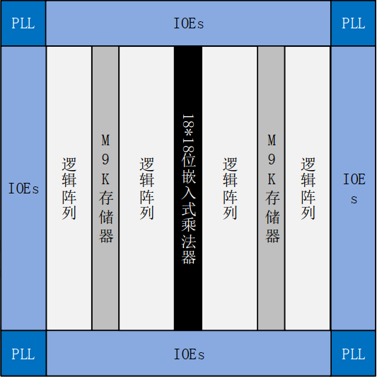

# 静态时序分析与约束

## 一. FPGA 与时序仿真的基本知识

1. 认识FPGA

   1. FPGA英文全称

      | Field | Programmable | Gate | Array |
      | ----- | ------------ | ---- | ----- |
      | 现场  | 可编程       | 门   | 阵列  |

   2. 百度词条

      ​	FPGA（Field Programmable Gate Array）是在PAL、GAL等可编程器件的基础上进一步发展的产物。它是作为专用集成电路（ASIC）领域中的一种半定制电路而出现的，既解决了定制电路的不足，又克服了原有可编程器件门电路数有限的缺点。

   3. FPGA的三要素

      

      1. 可编程逻辑功能块（logical element），Cell（单元 ）
         - 查找表（组合），D触发器（时序），进位链
      2. 片内互联线（interconnect），IC——内部连线
         - 连线线段和开关
      3. 输入输出块
         - 可编程输入输出完成芯片 内部逻辑与外部管脚之间的接口，围绕在逻辑单元阵列四周，可编程输入输出块的功能和性能从一定程度上也决定了该器件的市场定位
         - 输出寄存器，输入寄存器，输出使能寄存器，输入延迟链，输出延迟链，上拉电阻

   4. FPGA的扩展资源

      

2. 认识FPGA的时序仿真

   1. 什么是时序分析？

      - 针对当前的时序约束生成的时序报告，使用修改关键路径等方法使得设计更加的健壮，更加稳定

   2. 什么是时序约束？

      - 对当前设计进行合理的时钟频率设置，使EDA软件在布局布线时更加合理的利用FPGA的资源，指导编译软件对设计进行必要的优化，以使编译结果能够满足设计需求

   3. 为什么进行时序仿真？（时序仿真的目的）

      - 在设计流程是讲到有两种手段验证设计是否达到要求，其一是功能仿真；其二是静态时序分析
      - 功能仿真验证设计功能是否完善，若不完善，修改rtl代码完善功能
      - 时序仿真验证设计是否稳定且健壮，若不稳定，进行必要的时序分析并调整时序约束

      - 比如clk要运行在125M，就创建这个时钟的约束并约束频率为125M，那么软件看到这个约束之后，就会去优化这个时钟驱动的所有寄存器相关的布局布线，使这些寄存器之间的数据传输在125M的时候依旧不出错

   4. 时序分析与时序约束的关系

      - 在静态时序分析中，时序分析与时序约束是相辅相成的
      - 有了时序约束，EDA软件才会进行合理的布局布线，并生成当前时序约束的时序报告
      - 针对当前约束的时序报告，才能更好的改进时序约束。

## 二. 时序分析究竟在分析什么？

## 三. 时序分析软件中是怎么完成的？

## 四. 本文所用到的一些名词解释


时序分析

例程 class15_HGEX8

clk 是个时钟的角色，但是没有给其相应的时钟属性的分配

约束是针对时钟的

tck——测试时钟输入

有三个时钟信号的模型

slow/fast 1200mV 85C/0C  

温度越高，芯片内信号传输越慢

分析系统观察指标

- 分析建立时间余量的时候，主要观察85C慢速模型下的报告
- 分析保持时间余量的时候，主要观察0C快速模型下的报告

我们关注的是我们这个系统能跑多少兆，能跑多快，也就是系统的最高运行频率

分析和约束是相辅相成的，先有约束，软件才能根据约束进行分析

建立约束方法打给两种，加入约束文件或者使用软件集成的工具向导

- 加入约束文件——新建sdc file，编写sdc文件，使用tcl命令
- 根据工具向导建立约束——assignments-->Timequest
  - clk name创建一个新的时钟--》给时钟一个代号
  - clk pin指定其在文件中的引脚--》
  - period周期为20ns--》
  - rising上升沿的时间--》
  - falling下降沿的时间--》
  - 这就是创建时钟约束的过程，将时钟的基本信息在软件中设置

- 某时钟域的Fmax——由clk这个时钟驱动的所有寄存器里面，最坏路径能够运行的最低时钟频率
- 余量slack，只要余量为正就可以，理论上来说当然是余量越大越好
- Fmax = 1/（period - slack）
- 余量我理解就是还可以再快多少
- 建立时间余量——
- 保持时间余量——
- 最坏路径——
- launch clock
- latch clock 
- clock skew 时钟偏斜，同一时钟从不同路径到达每个触发器的时间差
- relationship
- data arrival path
- data requira path
- slack = dap - drp
- IObuf io缓冲单元
- warst-case timing paths
- FF——D触发器
- clock permision
- 延迟的类型
  - IC——内部连线
  - cell——单元 
  - 
  - Tdata——数据从源寄存器Q端出发到达目的寄存器D端的时间
  - Tclk ——时钟周期
  - 
  - 内部连线走线延迟
  - 组合逻辑单元延迟


时钟类型

- base基础时钟 
- generate生成时钟

在代码中的#1是在模拟真实寄存器从时钟上升沿到达其时钟管脚后数据要经过一定时间才能发生变化

TTA下的clocks的报告说的是当前工程中各个时钟信号的属性

这些是软件自动分析出来的工程中的一些时钟属性的信号

如果某个被认为是时钟的信号没相关的频率周期的定义，软件就会自动将其按照1000MHz的频率来进行分析

对于clk信号，Fmax = 149.77MHz，当前设计中，由clk信号驱动的寄存器，在clk频率为149.77MHz的时候，刚好还能正常工作

什么叫正常工作

- 数据被稳定的采样

sdc文件的作用

- 编辑器用来优化设计

create clock （约束）：创建时钟约束

```create_clock -name {clk} -period 20.000 -waveform { 0.000 10.000 } [get_ports {clk}]```

创建一个名为clk的时钟约束，这个时钟的周期是20ns，波形是0ns时上升沿，10ns时下降沿，该时钟衣服在具体的物理节点名为clk的端口上

```create_generated_clock -name {pll|altpll_component|auto_generated|pll1|clk[1]} -source [get_pins {pll|altpll_component|auto_generated|pll1|inclk[0]}] -duty_cycle 50.000 -multiply_by 2 -phase -90.000 -master_clock {clk} [get_pins {pll|altpll_component|auto_generated|pll1|clk[1]}]```

创建一个名为clk[1]的生成时钟，这个时钟 的生成源为inclk[0] ，占空比为50%将源时钟信号乘以2，并且移动-90度的相位，母时钟为clk，高生成的时钟信号衣服的具体物理节点为pll的clk1 端口

每个竖杠表示一个层级

如果工程没有添加任何约束文件，或者约束文件中没有任何有效的内容，软件会自动分析并加入软件自动分析出来的时钟信号并加入合理的约束

一旦工程中加入有效的sdc文件中软件就一切以sdc文件中的约束为准，不再自动分析和加入其它信号的约束

使用assignments下的TimeQuest Timing Analyzer wizard创建时钟约束（创建时信号名不必与管脚名相同）

在settings中设置TTA所用的sdc，将不用的sdc文件删除

一个工程中如果添加了多个sdc文件且同时生效的话，软件会一次按照这两个文件中的内容进行约束和报告，如果对某一个节点在多个约束文件中都添加了约束信息，则后执行的约束内容会覆盖掉先执行的约束内容

 创建时钟约束的两个作用

- 

 


 现场可编程门阵列

三要素

- 可编程逻辑功能块（logical element）——查找表（组合），D触发器（时序），进位链
- 片内互联线（interconnect）
  - 连线线段和开关
- 输入输出块
  - 可编程输入输出完成芯片 内部逻辑与外部管脚之间的接口，围绕在逻辑单元阵列四周，可编程输入输出块的功能和性能从一定程度上也决定了该器件的市场定位
  - 输出寄存器，输入寄存器，输出使能寄存器，输入延迟链，输出延迟链，上拉电阻

pll与dll的区别：pll是数字的，dll是模拟的，pll精度较高

 时序分析的目的

- 时序分析的目的就是通过分析FPGA设计中各个寄存器之间的数据和时钟传输路径，来分析数据延迟和时钟延迟之间的关系，一个设计完善的系统，必然能够保证整个系统中所有的寄存器都能够正确的寄存数据
- 数据和时钟传输路径是由EDA软件，针对特定器件布局布线得到的
- 时序约束两个作用：
  - 告知EDA软件，改设计需要达到怎样的时序指标，然后EDA软件会根据时序约束的各个参数，尽力优化布局布线，以达到该约束的指标
  - 协助EDA软件进行分析设计的时序路径，以产生相应的时序报告

时序分析基本模型 

- ```verilog 
  module (
  	clk,
      a,
      b,
      c
  );
      input clk;
      input a;
      input b;
      output c;
      
      reg a_reg;
      reg b_reg;
      
      wire c_wire;
      
      always@(posedge clk)begin 
          a_reg <= a;
      	b_reg <= b;
      end
      
      assign c_wire = a_reg & c_reg;
      always@(posedge clk )
          c <= c_wire ;
  endmodule     
  //思考上述代码的电路图
  //两个D触发器一个与门一个输出的D触发器
  //思考时序图
  /*
  - tco——输出时间，时钟上升沿到达D触发器  到  数据输出到Q端的延迟
  - tsu——建立时间，目的寄存器特性决定，在时钟信号上升沿到达其时钟接口时，其数据输入端（D）的数据必须提前Nns稳定下来，否则就无法保证数据正确存储。寄存器要求的，其数据端口的值必须提前于时钟上升沿达到其时钟端口的时间值*/
  D触发器 D端口的数据必须必时钟上升沿到达的时间提前Nns到达D触发器的端口
  ```

分析例程class8_bin_counter

最高的时钟频率？

这个需要时序分析软件来告知

通过timequest 软件对设计进行分析，并给出报告

时序分析一定是基于器件（集体到某一个特定信号的特定速度登记）

时序分析一定是基于逻辑设计在该特定器件上经过布局布线之后的网表（该网表包含了设计中每一个逻辑具体在该器件的什么资源上实现，而且还包括该资源在器件内的具体位置，还包括信号从每个节点传输到下一个节点的具体延迟时间）

时序分析不是在对代码进行分析，而是在对真是的门级传输路径进行分析

TTA的报告——clocks

clocks 1GHz——（这个是软件报告的设计中的时钟信号的约束频率），这是应为如果用户没有对时钟信号加约束，软件就会自动对分析出的时钟信号加入约束，这个约束会按照最大的可能来约束，也就是设置时钟频率为1000MHz

芯片的工作温度，工作模式

- slow 1200mV 85C model
  - Fmax summary 242.42MHz 这个就是改设计能够运行的最大时钟频率
    - 改设计实际运行在50MHz的时钟频率，开发板上使用的是50MHz的时钟竞争
    - 但软件认如果没加时序约束的设计默认输入的时钟频率为1000MHz
    - 软件计算最高时钟频率的时候，是根据最坏路径的建立时间余量来计算的
  - worst case Timing paths
- slow 1200mV 0C model
- fast 1200mV 85C model

如何告诉时序分析软件我们的时钟频率是多少？

约束：时钟约束，怎么约束呢？

工具：Timiequest timing analyzer  

1. 打开TTA软件
2. 创建一个网表 create Timing Netlist
3. 读取sdc文件 
4. 查看报告，加入约束
   1. constraints---->create clock（创建时钟约束）
   2. 创建名字，周期，以及占空比（默认50%）
5. 在TTA中每执行一个操作之后，都需要特别留意console窗口中的报告，要观察操作是否生效
6. 所有约束操作完成后需要执行写sdc文件的操作，这个文件会生成包含所有约束的sdc文件

上述操作执行完成后FMAX= 198.88MHz，相较于之前的242.42MHz，该设计可以运行的最高频率变低了，这是因为EDA软件在进行布局布线时会以时序约束的时钟频率为指标，在完成布局布线时会自动的向这个目标看齐，如果不能达到，那么会出现slack为负的情况，如果时序约束合理，那么slack为正，在看齐目标时，Fmax表示在当前的设计（网表文件）中，该设计运行的最高频率，所以约束不同，布局布线的情况不同，Fmax也就不同。

作用：

- 知道EDA软件对设计的布局布线进行合理优化以尽量满足需求
- 给时序分析工具提供一个分析时序的参考

课程内容

- 基于timequest软件来查看时序报告，
- 分析时序路径，
- 回顾基于RTL的逻辑时序优化的基本思路，
- 在关键路径中插入寄存器来优化逻辑

from node 起点源寄存器

to node 目标寄存器

launch clock 源寄存器发射数据的时钟

latch clock目的寄存器接收数据的时钟

relationship launch clockedge 和 latch clock edge的时间差（如果两个时钟非同一个信号，而是有一定相位关系的同源时钟，则relation不在是时钟的周期值）

选中一条路径，然后右击，点击 report timing

如果没有错误路径，但是我们仍然想查看这条路径的时序信息，此时可以手动报告路径

手动报告路径：

- TTA软件下 custom reports===》reporting timing 设置观察路径的起始寄存器与目的寄存器然后就可以查看

在TTA软件中将tco和数据传输路径延迟Tdata 合并成为data delay

数据经过tclk1和data delay之后，到达目的寄存器的D端口

时钟悲观 clock_pessimism = 0.015ns

slack 数据需求时间和数据到达时间的差值，如果为正值，则表明数据能被目的寄存器正确接收，如果是负值，则表明数据不能被目的寄存器正确接收 


要使得目的寄存器能够正确的接收源寄存器发送过来的数据就要求

- tclk1 + tco + tdata <= tclk + tclk2 -tsu===>数据实际到达的时间 <= 数据需求时间

目的寄存器若能够正确接收到源寄存器发送过来的数据那么，参考下面的两个式子，考虑最终目的是要分析slack最小的路径，也就是要减小tskew 

- slack =（tclk + tskew - tsu - tco - tdata）>=0，这个式子中的变量是Tskew，其他都是在硬件以及布局布线确定后的定值（slack建立时间余量）
- tskew = (tclk2 - tclk1 + clock_pessimism )
  - Tclk1 <= （软件计算值）2.631ns（分析计算tclk1的时候，会认为时钟从源端出发按照最慢的速度到达源寄存器的时钟端口）
  - Tclk2 <= （软件计算值）2.534ns（分析计算tclk2的时候，会认为时钟从源端口出发按照最快的速度到达目的寄存器时钟端口）
  - 这就引出一个矛盾：时钟在传输过程中，到达目的寄存器和源寄存器是中间有一段路径时重合的，这就是说tclk1按照慢速来算，tclk2 按照快速来算，对于重合部分，在实际中不可能又快又慢，这就要是说在算tclk1的时候有点悲观，将这个时间算大了，这时候需要加入一个补偿量也就是clock pessimism
  - 理论上来说时钟是精确的，但实际上时钟是不可能精确的，存在一定的时钟抖动，这是后会存在一个值叫做 clock uncertainly 该值会被算入 data require time
- slack = tclk + tclk2 + clock_pessimism + clock _uncertainly - tsu     - tclk1     - tco - tdata
- 6.878 = 10+  2.534+  0.15                        -0.02                      +0.021-2.631     -3.041


skew = -0.082

Tclk1 = 2.631ns

Tclk2 = 2.534ns

Tskew = 2.534-2.631+0.015 = -0.082ns

时钟偏斜skew：

- 时钟从源端口出发，到达目的寄存器和源寄存器的时间差值


第三课

1. 约束电路中所有的时序路径
   1. 输入到寄存器的路径
   2. 寄存器到寄存器之间的路径
   3. 寄存器到输出的路径
   4. 输入直接到输出的路径
2. 优化步骤
   1. 在电路综合的过程中，所有时序电路以及组合电路的优化都是以时钟为基准来计算路径延迟的，因此，一般都要在综合的时候指定时钟，作为估计路径延迟的基准

时钟周期，pad to pad time，clock setup time，clock hold time，clock to output delay