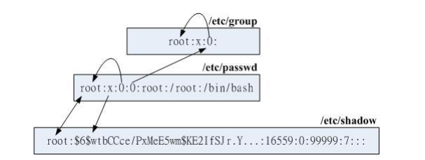

| 按键            | 作用                                         |
| --------------- | -------------------------------------------- |
| `Ctrl+c`        | 打断正在运行的程序                           |
| `Ctrl+d`        | 键盘输入结束或退出终端                       |
| `Ctrl+s`        | 暂停当前程序，暂停后按下任意键恢复运行       |
| `Ctrl+z`        | 将当前程序放到后台运行，恢复到前台为命令`fg` |
| `Ctrl+a`        | 将光标移至输入行头，相当于`Home`键           |
| `Ctrl+e`        | 将光标移至输入行末，相当于`End`键            |
| `Ctrl+k`        | 删除从光标所在位置到行末                     |
| `Alt+Backspace` | 向前删除一个单词                             |
| `Shift+PgUp`    | 将终端显示向上滚动                           |
| `Shift+PgDn`    | 将终端显示向下滚动                           |

常见英文单词

NAME（名称）, SYNOPSIS（概要），DESCRIPTION（说明），EXAMPLES（示例），SEE ALSO（参见），OPTIONS（选项），EXIT STATUS（退出状态），ENVIRONMENT（环境），BUGS（程序漏洞），FILES（文件），AUTHOR（作者），REPORTING BUGS（已知漏洞），HISTORY（历史）和 COPYRIGHT（版权）。

Linux中一切皆文件

- 查看目录，根目录，绝对目录，相对目录，工作目录切换
- 创建文件，编辑文件，复制文件，移动文件，文件重命名
- 创建文件夹，复制文件夹，指定文件夹的父目录

查看进程，调整进程

vim编辑器中i和A 在插入文本中有什么用？

| 变量设置方式                   | 说明                                         |
| ------------------------------ | -------------------------------------------- |
| `${变量名#匹配字串}`           | 从头向后开始匹配，删除符合匹配字串的最短数据 |
| `${变量名##匹配字串}`          | 从头向后开始匹配，删除符合匹配字串的最长数据 |
| `${变量名%匹配字串}`           | 从尾向前开始匹配，删除符合匹配字串的最短数据 |
| `${变量名%%匹配字串}`          | 从尾向前开始匹配，删除符合匹配字串的最长数据 |
| `${变量名/旧的字串/新的字串}`  | 将符合旧字串的第一个字串替换为新的字串       |
| `${变量名//旧的字串/新的字串}` | 将符合旧字串的全部字串替换为新的字串         |

linux目录结构
usr --》windows  programfile
etc --》存放系统的各种配置
home--》存放其他用户的目录
root--》存放root用户的数据
bin --》二进制可执行文件，类似于exe
sbin--》二进制可执行文件，但是只有root可以访问
boot--》启动项，系统启动时使用

pwd显示当前路径
d代表一个目录
-代表一个文件

ll  列出当前目录下的文件信息
ls-al列出当前目录下的文件信息，包括隐藏文件，特殊目录
ll  /bin/  列出跟目录下bin目录下的信息

cd  ~当前用户目录
cd /  切换到根目录
cd - 上一次访问的目录
cd ..上一级目录
cd  切换到登录时的目录，root 用户就是root目录下，其他用户就是home目录下

登录linux时，root 用户就是root目录下，其他用户就是home目录下
touch 1.txt  创建一个文件

pwd print working directory
mkdie  make directory
绝对目录与相对目录
mkdir  -pv  c/d/e  创建多级目录，如果父目录不存在，先创建父目录，并且显示详细信息
-pv  prents（父目录），v详细信息

cat catence 显示文件内容 
可以设置交互窗口，
more/less 文件名
enter  按行步进
less后面可以加的参数有-m显示百分比每行的行号
在less 可以使用 查找命令参数为/ 然后输入逍遥查找的命令

tail命令，用于显示指定文件末尾内容，不指定文件时，作为输入信息进行处理

tail 的参数是可以加想要显示行数

文件浏览命令总结
cat 如果文件内容很少，一页可以显示完，
cat 命令可以指定查看某个路径下的文件

more 如果文件内容较多，可以使用more
less 功能比more强大，最主要的是可以进行搜索
但是less后面要接参数 -mN显示行号
tail -10 查看文件末尾后十行的命令

文件管理，文件操作
cp copy
cp 源文件 目标文件  注意文件名 要不同
cp -b 源文件 目标文件 目标文件重名，将重名文件备份并且后面加上~以表示备份，然后目标文件替代重名文件

要知道，文件名也包括路径，但是在当前路径下操作文件可以省略文件的路径

cp ./文件名   ../ 将当前目录下的文件复制到他的父级目录
cp -r ./目录a  ./目录b  复制一个目录
recursive  递归复制
mv相当于剪切
mv  可以重命名文件，
rm  删除文件
rm -r 删除目录

/ 代表根目录  ./ 代表当前目录  ../代表父级目录
在进行文件操作时，文件名包括路径，操作当前目录下的文件可以省略文件路径，也可以使用./代替
操作不是当前路径下文件需要加上文件名

mv  move 可以是移动文件，也可以重名名文件，
rm  remove 删除文件，
在使用  mv 和rm文件对目录进行操作时，要加上表示递归操作的 -r

find命令
在某个目录下搜索
find /root/ -name  'in*'  在根目录下寻找名称中包含in而且是以in开头的文件名

vim  ./文件名  打开当前目录下的文件
vim  使用就是个习惯的问题
三个模式，一般模式，低行模式，插入模式
last line mode 
command mode
insert mode 

grep  过滤搜索功能
grep -i 要查找的命令

管道命令  命令的一种输入方式
命令1 | 命令2
命令1作为命令2的输入，然后与命令2的形式输出

ps -ef |grep -i crond
查看系统进程中crond 的信息

ping
ifconfig

  

\

- 内核功能
  - 进程管理
  - 内存管理
  - 文件系统
  - 网络功能‘
  - 硬件驱动
  - 安全机制
- linux 的基本原则
  - 由目的单一的小程序组成，组合小程序完成复杂任务
  - 一切皆文件
  - 尽量避免补货用户接口
  - 配置文件保存为纯文本格式
- shell接口--》我们使用的是Bash
  - 人机交互接口
  - 键入命令，回车键，命令被Bash送给内核执行
- GUI接口
- #：root
- $：普通用户
- 命令格式
  - 命令 选项  参数
    - 选项 ：
      - 长选项：--以两个"--"开头，一般不能组合使用
      - 短选项：- 以一个"-"开头，多个短选项可以组合使用
    - 参数：命令作用的对象
- 使用凭证
- 虚拟终端Terminal：
- su: switch user
- dll: dynamic link library
- .so: shared object
- IDE: 
- 认证机制：Authentication
- 授权：Authorization
- 审计：Audition
- magic number 魔数
- 文件类型
  - “-”，普通文件
  - “d”，目录文件
  - “b”，块文件
  - “c”，字符设备文件
  - “l”，符号链接文件
  - “p”，命令管道文件
  - “s”，套接字文件
- 文件权限
- 文件链接次数
- 文件大小的单位是字节
- 文件的三个时间
- ls -R：递归显示
- cd：change directory
- 家目录，主目录，home directory
- 命令类型
  - 内置命令（shell内置）
  - 外部类型在文件系统的某个路径下有一个与命令名称相应的可执行文件
- 如果使用每一个可执行文件都需要带目录，那么就非常麻烦
- 环境变量，命名的内存空间
- 变量赋值 NAME=Jerry，使用NAME就相当于使用Jerry
- 变量只在当前程序中应用，变量声明的过程就是告诉程序给我一段内存，我要在这段内存中放数据拉
- 声明变量就是告诉bash变量是啥
- 堆heap，比如打开一个文件，
- 栈stack，本都声明的一些变量和静态变量
- 堆栈是两种不同的内存分配方式
- type，显示指令属于那种类型 

- PATH：只用“：”隔开的路径，当我们使用一个命令时，就从path中的目录下找这个命令的可执行文件，一旦找到一个，就不继续向后查找
- 第一次执行某一个命令时，他会按照path查找，第二次执行时就不找了，他把命令放在一个文件中，下次使用相同命令直接就能找到，这个文件名叫hash，第一列是使用次数，hits，命中次数
- 缓存为王 catch is King
- 计算机系统的速度与缓存有关
- 找缓存的速度比利用path找快
- hash也就是哈希，他存储的是一个键值对，hash的运算量级是O(1)
- 练习数据结构中讲过的概念
- 显示当前系统的时间date
- date时间管理
- 网络时间协议ntp
  - 硬件时钟
  - 系统时钟
- 获得命令的使用帮助
  - 内部命令
    - help 命令
  - 外部命令
    - 命令 --help
  - 命令手册manual
    - 分章节,八章
    - 1. 用户命令
      2. 系统调用
      3. 库用户
      4. 特殊文件（设备文件）
      5. 文件格式（配置文件的语法）
      6. 游戏
      7. 杂项（不便归类的命令）
      8. 管理命令（/sbin，/usr/sbin，/usr/local/sbin）
    - <>：必选
    - []：可选
    - ...：可以出现次数
    - |：多选一
    - {}：分组
  - MAN
    - NAME：命令名称及功能简单说明
    - SYNOPSIS：用法说明，包括可用的选项
    - DESCRIPTION：命令功能的详尽说明，可能包括每一个选项的意义
    - OPTIONS：说明每一选项的意义
    - FILES：此命令的相关的配置文件 
    - EXAMPLE：示例文件
  - 翻屏
    - 向前翻一屏 b，一行k
    - 向后翻一屏space，一行enter
  - 查找
    - /KEYWORD：向后查找
    - ?KEYWORD：向前查找
    - n下一个，N前一个
    - q退出
- 转义和逃逸

在Linux系统中，每个文件都有所属的所有者和所有组，并且规定了文件的所有者、所有组以及其他人对文件所拥有的可读（r）、可写（w）、可执行（x）等权限。对于一般文件来说，权限比较容易理解：“可读”表示能够读取文件的实际内容；“可写”表示能够编辑、新增、修改、删除文件的实际内容；“可执行”则表示能够运行一个脚本程序。但是，对于目录文件来说，理解其权限设置来就不那么容易了。文件的读、写、执行权限可以简写为rwx，亦可分别用数字4、2、1来表示，文件所有者，所属组及其他用户权限之间无关联。文件权限的数字法表示基于字符表示（rwx）的权限计算而来，其目的是简化权限的表示。例如，若某个文件的权限为7则代表可读、可写、可执行（4+2+1）；若权限为6则代表可读、可写（4+2）。从下图可以找到本题所对应的值为：744，另外，在Linux中修改权限的命令用“chmod”

